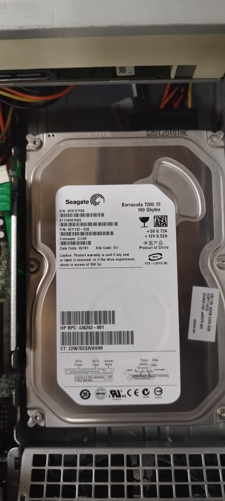

# 10 — Toma de datos (taller)

| Componente | Marca/Fabricante | Modelo/Serie | Características técnicas visibles | Foto |
|---|---|---|---|---|
| **Placa base** | HP | HP Compaq 7800 | Chipset Intel Q35 / Socket LGA775 / 4 slots RAM DDR2 |  |
| **Microprocesador** | Intel | Intel Core 2 Duo | Frecuencia 2.66 GHz |  |
| **Memoria RAM** | Elpida | EB110D8A6WA-6E-E | DDR2 / Capacidad no visible / Frecuencia no visible |  |
| **Disco HDD/SSD** | Seagate | Barracuda 7200.10 | HDD SATA / Capacidad no visible |  |
| **Fuente de alimentación** | HP | PDS-240MB-1 A | Potencia 240 W / Certificación no visible |  |
| **Otros (GPU/Tarjetas)** | Silicon Image | Silicon Image DualPad PCIe x16 | Tarjeta controladora PCI Express x16 |  |
