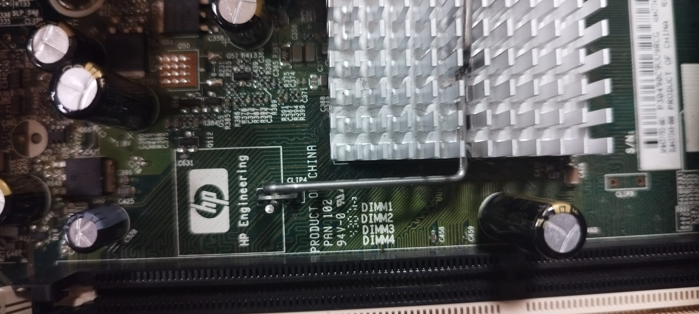
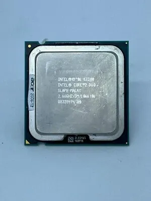
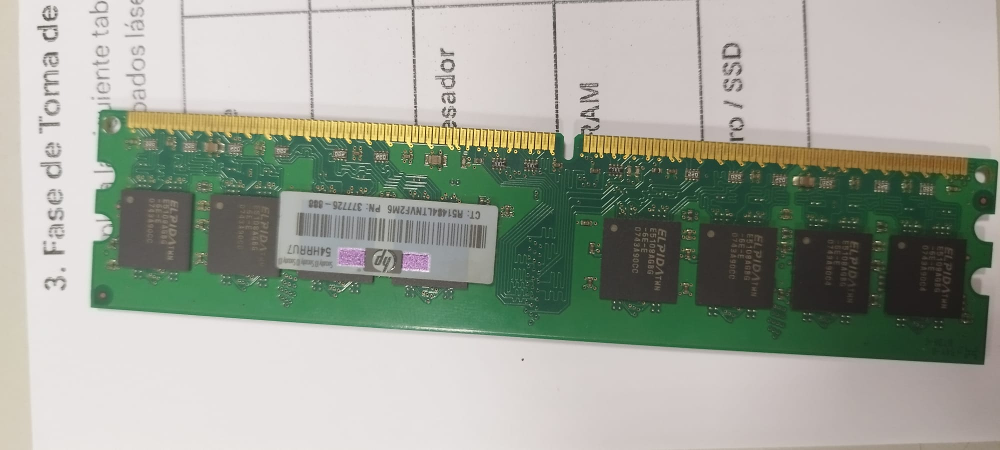
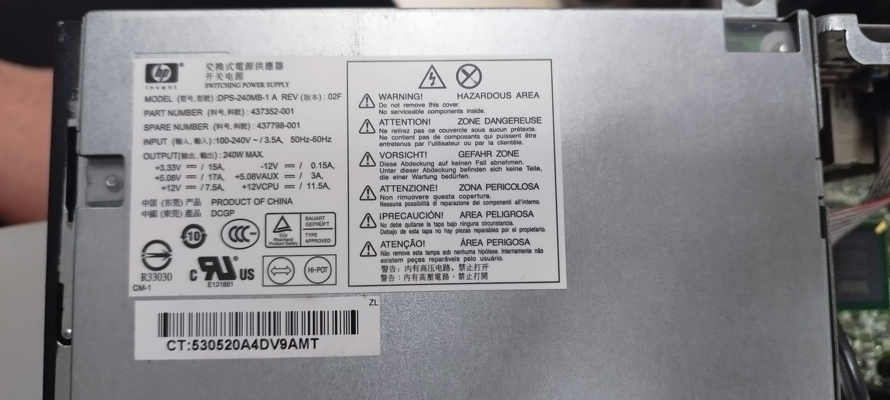
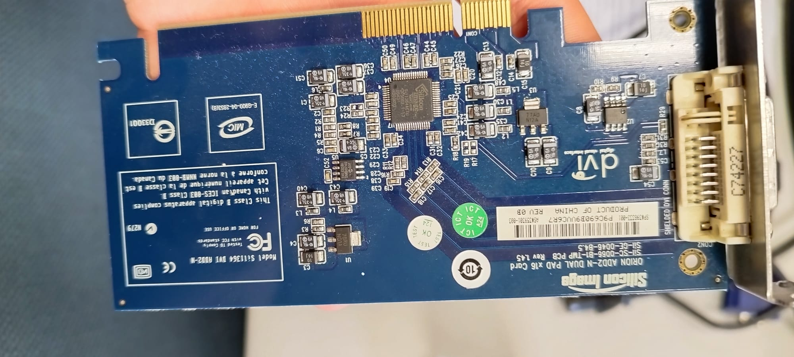
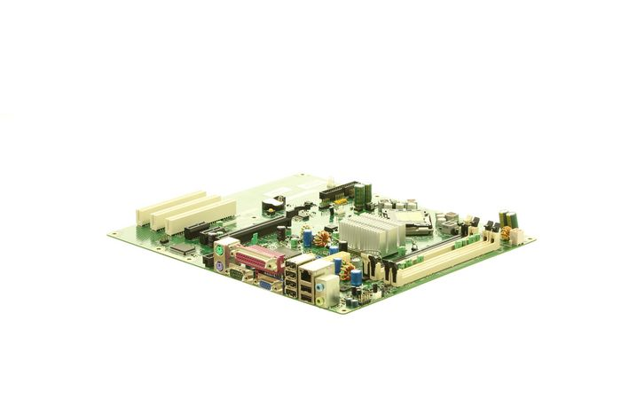
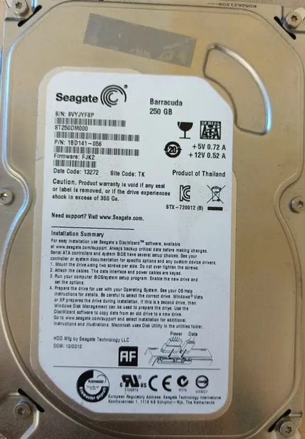
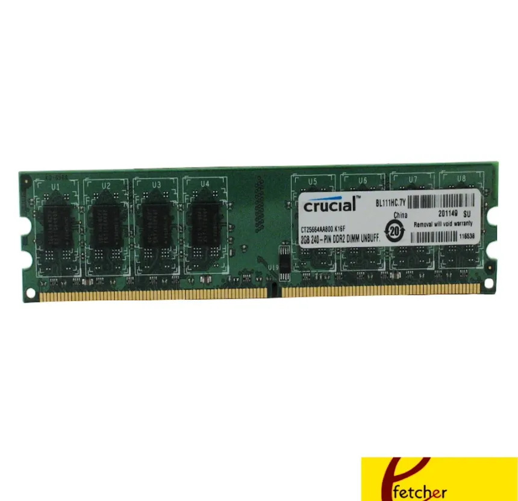

# 90 — ENTREGA ÚNICA (consolidado)

Copia aquí lo esencial de **toma de datos**, **investigación técnica**, **recambios** y **observaciones**, con las **imágenes clave** (rutas relativas).

## Portada

# 00 — Portada
- Alumno/a: _Jesus Soto_
- Puesto/Equipo asignado: _Nº o etiqueta del equipo_
- Fecha: _31/01/2026_
- Módulo: **Fundamentos de Hardware (1º ASIR)**
- Unidad: **UT3 — Ensamblado de equipos**
- Reto: **Reto 01 — Práctica de Taller**

## Indice

# 01 — Índice
1. [Portada](00-portada.md)
2. [Instrucciones](02-instrucciones.md)
3. [Toma de datos en taller](10-toma_de_datos/plantilla_tabla_taller.md)
4. [Investigación técnica](20-investigacion_tecnica/plantilla_investigacion.md)
5. [Mercado y recambios](30-mercado_y_recambios/plantilla_recambios.md)
6. [Observaciones personales](40-observaciones/plantilla_observaciones.md)
7. [ENTREGA ÚNICA](90-ENTREGA_UNICA.md)
8. [Checklist](99-entrega_y_checklist.md)

---
## Toma de datos — resumen
_(tabla o listado breve + 1–2 fotos)_
# 10 — Toma de datos (taller)

| Componente | Marca/Fabricante | Modelo/Serie | Características técnicas visibles | Foto |
|---|---|---|---|---|
| **Placa base** | HP | HP Compaq 7800 | Chipset Intel Q35 / Socket LGA775 / 4 slots RAM DDR2 |  |
| **Microprocesador** | Intel | Intel Core 2 Duo | Frecuencia 2.66 GHz |  |
| **Memoria RAM** | Elpida | EB110D8A6WA-6E-E | DDR2 / Capacidad no visible / Frecuencia no visible |  |
| **Disco HDD/SSD** | Seagate | Barracuda 7200.10 | HDD SATA / Capacidad no visible |  |
| **Fuente de alimentación** | HP | PDS-240MB-1 A | Potencia 240 W / Certificación no visible |  |
| **Otros (GPU/Tarjetas)** | Silicon Image | Silicon Image DualPad PCIe x16 | Tarjeta controladora PCI Express x16 |  |

## Investigación técnica — resumen

## 1) Detalles del procesador
- Modelo exacto: Intel Core 2 Duo (serie E6xxx, 2.66 GHz)
- **Núcleos/Hilos:** 2 núcleos / 2 hilos  
- **TDP:** 65 W  

**Respuesta:**  
El equipo monta un procesador Intel Core 2 Duo de la serie E6xxx con una frecuencia de 2.66 GHz. Dispone de 2 núcleos y 2 hilos de ejecución, con un TDP aproximado de 65 W, típico de esta generación de procesadores para equipos de sobremesa.

## 2) Soporte de memoria (según placa base)
- Modelo exacto de placa: HP Compaq 7800 (chipset Intel Q35)
- **Capacidad máxima RAM:** 8 GB  
- **Velocidad máxima soportada:** DDR2 800 MHz  

**Respuesta:**  
La placa base HP Compaq 7800, basada en el chipset Intel Q35, admite memoria DDR2 con una capacidad máxima total de hasta 8 GB y una velocidad máxima soportada de 800 MHz, distribuida en sus cuatro ranuras de memoria.

## Recambios — resumen
# 30 — Mercado y recambios

## 1) Placa base
- **Componente a sustituir:** Placa base HP Compaq dc7800  
- **¿Existe el mismo modelo exacto en tiendas?** Solo segunda mano  
- **Alternativa compatible (socket/ranura):**  
  Placa base HP Compaq dc7800 OEM (socket LGA775, chipset Intel Q35, soporte DDR2)  
- **Precio aproximado (€):** 150–180 €  
- **URL:**  
  (https://www.eetgroup.com/en-eu/rp000112168-hp-compaq-dc7800-cmt-motherboard-with-intel-support-wid-w124571961) 
- **Captura:**  
  

**Justificación breve:**  
Es la placa base original del equipo, totalmente compatible con el procesador Intel Core 2 Duo y la memoria DDR2 instalada. Permite mantener la configuración sin modificar otros componentes.

---

## 2) Disco duro
- **Componente a sustituir:** Disco duro HDD Seagate Barracuda 7200.10  
- **¿Existe el mismo modelo exacto en tiendas?** Solo segunda mano  
- **Alternativa compatible (socket/ranura):**  
  Disco duro HDD 3.5" SATA 7200 rpm (cualquier marca compatible SATA)  
- **Precio aproximado (€):** 15–30 €  
- **URL:**  
  https://www.ebay.es  
- **Captura:**  
  

**Justificación breve:**  
La placa base dispone de interfaz SATA estándar, por lo que cualquier disco duro SATA de 3.5" es compatible aunque no sea el modelo exacto original.

---

## 3) Memoria RAM
- **Componente a sustituir:** Memoria RAM DDR2  
- **¿Existe el mismo modelo exacto en tiendas?** Solo segunda mano  
- **Alternativa compatible (socket/ranura):**  
  Módulos DDR2 DIMM PC2-6400 (800 MHz) compatibles con HP Compaq dc7800  
- **Precio aproximado (€):** 10–30 € por módulo  
- **URL:**  
  https://www.offtek.es  
- **Captura:**  
  

**Justificación breve:**  
La placa base del HP Compaq dc7800 admite memoria DDR2 hasta 800 MHz, por lo que módulos DDR2 estándar DIMM son totalmente compatibles aunque no sean del fabricante original.

## Observaciones — resumen

- **Observación 1:** Se aprecia acumulación de polvo en el interior del equipo, especialmente en el disipador del procesador y en la fuente de alimentación, lo que puede afectar a la refrigeración.
- **Observación 2:** El cableado interno no está bien organizado, lo que dificulta el flujo de aire y puede provocar un aumento de la temperatura interna.
- **Observación 3:** El equipo utiliza componentes antiguos (DDR2 y disco HDD), lo que limita el rendimiento general; una mejora posible sería sustituir el disco duro por un SSD SATA para aumentar la velocidad del sistema.

