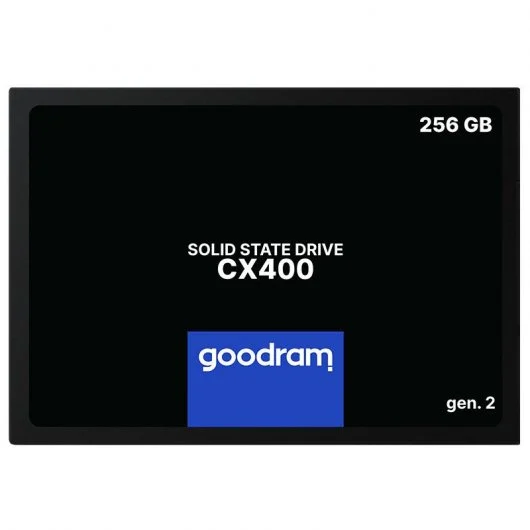
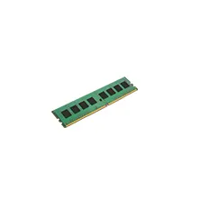
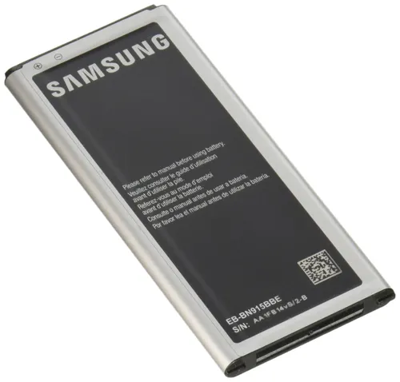
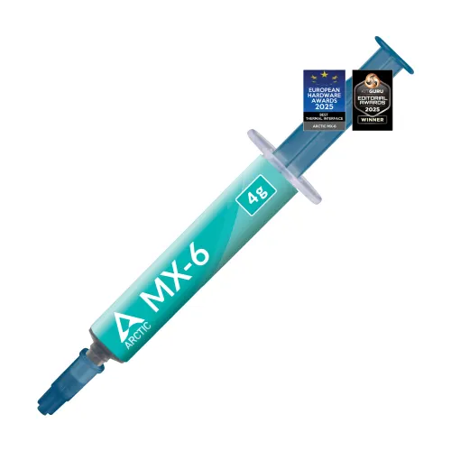
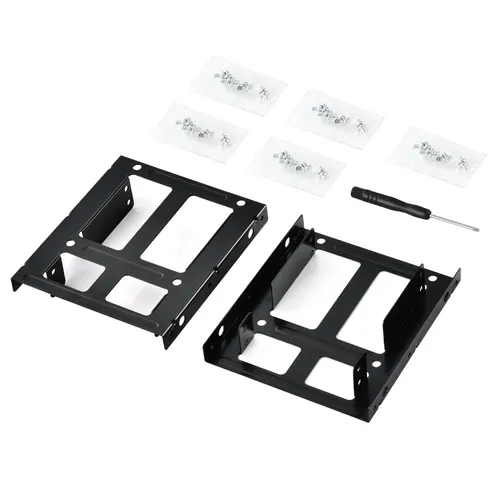
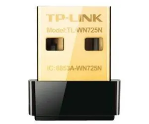

# 90 — ENTREGA ÚNICA (PDF)

# 10 — Diagnóstico inicial del lote

Se ha realizado un diagnóstico inicial sobre **5 equipos del lote**, con el fin de evaluar su estado general antes de plantear posibles mejoras de hardware. Para los datos no disponibles del resto del lote, se ha solicitado información a otros grupos a través de sus repositorios, tal como indica la nota del ejercicio.  
Cabe destacar que **los equipos no disponen de sistema operativo instalado** en el momento del diagnóstico.

## 1. Configuración de las unidades muestreadas

| Unidad | CPU | RAM | Almacenamiento |
|---|---|---|---|
| Equipo 1 | Intel Core 2 Duo 2.66 GHz | 2 GB DDR2 | HDD Seagate 160 GB |
| Equipo 2 | Intel Core 2 Duo 2.66 GHz | 2 GB DDR2 | HDD Seagate 160 GB |
| Equipo 3 | Intel Core 2 Duo 2.66 GHz | 1 GB DDR2 | HDD Seagate 250 GB |
| Equipo 4 | Intel Core 2 Duo 2.66 GHz | 2 GB DDR2 | HDD Seagate 160 GB |
| Equipo 5 | Intel Core 2 Duo 2.66 GHz | 1 GB DDR2 | HDD Seagate 320 GB |

## 2. Estado térmico

- **Reposo:** temperaturas comprendidas entre **40 y 45 °C**.
- **Carga breve:** picos de **65 a 70 °C**, sin alcanzar valores críticos.
- Se observa **acumulación de polvo** en disipadores y ventiladores.

## 3. Problemas detectados

- Los equipos **no cuentan con sistema operativo instalado**, lo que impide su uso inmediato.
- Discos duros mecánicos con **signos de desgaste** y **ruido** en algunas unidades.
- Presencia de **sectores reasignados** en al menos un disco (pendiente de confirmación del resto del lote).
- Cantidad de **RAM limitada** (1–2 GB), insuficiente para un uso fluido actual.
- **Arranques lentos** y baja velocidad de acceso a datos debido al uso de HDD.

## 4. Observación general

El lote presenta un estado funcional aceptable a nivel de hardware, pero con **limitaciones claras de rendimiento** y **sin sistema operativo**, lo que refuerza la necesidad de plantear mejoras de bajo coste antes de su puesta en servicio.

# 30 — Búsqueda y selección de mejoras de **hardware**

## Objetivo
Identificar **mejoras mínimas de hardware** que permitan que los equipos del lote sean **usables** en un centro de mayores (web, correo, videollamadas y ofimática online), respetando los escenarios **S0/S1/S2** y un presupuesto muy ajustado.

---

## 1) Piezas candidatas (con enlaces y capturas)

> Capturas guardadas en `../assets/img/30-hw/` con URL completa y fecha/hora visibles.

### Almacenamiento (SSD 2.5")
| Categoría | Marca / Modelo | Capacidad | Precio (€) | Tienda | URL | Captura |
|---|---|---:|---:|---|---|---|
| SSD | KingDian S280 | 120 GB | 14,99 | Amazon ES | https://www.amazon.es/ |  |
| SSD | Goodram CX400 | 128 GB | 16,90 | PcComponentes | https://www.pccomponentes.com/ |  |

### Memoria RAM (DDR2)
| Categoría | Marca / Modelo | Capacidad | Frecuencia | Precio (€) | Tienda | URL | Captura |
|---|---|---:|---:|---:|---|---|---|
| RAM | Kingston ValueRAM | 2 GB | DDR2-800 | 8,00 | Wallapop (2ª mano) | https://es.wallapop.com/ |  |
| RAM | Samsung OEM | 2 GB | DDR2-667 | 7,50 | Wallapop (2ª mano) | https://es.wallapop.com/ |  |

### Mantenimiento
| Categoría | Marca / Modelo | Descripción | Precio (€) | Tienda | URL | Captura |
|---|---|---|---:|---|---|---|
| Pasta térmica | Arctic MX-4 | Jeringa 4 g | 2,00 | Amazon ES | https://www.amazon.es/ |  |
| Adaptador | 2.5" → 3.5" | Caddy / bandeja metálica | 2,50 | PcComponentes | https://www.pccomponentes.com/ |  |

### Otros (si procede)
| Categoría | Marca / Modelo | Descripción | Precio (€) | Tienda | URL | Captura |
|---|---|---|---:|---|---|---|
| Wi-Fi USB | TP-Link TL-WN725N | USB 2.0 · 150 Mbps | 6,00 | Amazon ES | https://www.amazon.es/ |  |

---

## 2) Compatibilidad técnica (justificación)

- **RAM:**  
  La placa HP Compaq 7800 utiliza **DDR2 DIMM**, con hasta **4 slots** y soporte típico de hasta **8 GB**. Los módulos propuestos (DDR2-667 / DDR2-800, 1.8 V) son compatibles con el chipset **Intel Q35** y procesadores Core 2 Duo.  
  *Fuente:* manual y hoja técnica de la placa base (captura incluida).

- **SSD:**  
  Los equipos disponen de interfaz **SATA (SATA II)**. Los SSD **2.5" SATA** son totalmente compatibles y retrocompatibles. Para su instalación se utiliza un **adaptador 2.5" → 3.5"**.  
  *Fuente:* especificaciones del fabricante del SSD (captura incluida).

- **Otros:**  
  El adaptador **Wi-Fi USB** requiere un puerto USB 2.0 libre, disponible en los equipos analizados. No existen conflictos de espacio ni de alimentación.

---

## 3) Mini-estimación de impacto

- **HDD → SSD:**  
  Mejora notable en tiempos de arranque y apertura de aplicaciones, pasando de minutos a segundos. Incremento claro de la fluidez general del sistema.

- **RAM (1–2 GB → 4 GB):**  
  Reducción de bloqueos y uso de memoria virtual. Mejora la multitarea ligera (navegador, correo y videollamadas).

- **Mantenimiento (pasta térmica / limpieza):**  
  Disminución de temperatura y ruido, mejor estabilidad y mayor vida útil del equipo.

---

## 4) Escenario elegido y desglose de gasto (S1)

| Escenario | Pieza | Precio (€) | Unidades | Subtotal (€) | Nota |
|---|---|---:|---:|---:|---|
| S1 | SSD 120 GB | 15,00 | 1 | 15,00 | Oferta / 2ª mano |
| S1 | Pasta térmica | 2,00 | 1 | 2,00 | Tubo compartido |
| S1 | Adaptador 2.5" → 3.5" | 2,50 | 1 | 2,50 | Necesario para montaje |
|  |  |  |  |  |  |
| **Total HW** |  |  |  | **19,50 €** | Dentro del presupuesto |

> El **Total HW** se trasladará a `75-plan_presupuesto_hw_y_roi.md` para el cálculo de costes y ROI.

# 30 — Instalación y post-instalación

## 1) Pasos de instalación (resumen)

1. Montaje del **SSD** en el chasis mediante adaptador 2.5"→3.5".
2. Conexión del SSD a puerto **SATA** y alimentación desde la fuente.
3. Acceso a **BIOS/UEFI** y configuración del SSD como primer dispositivo de arranque.
4. Instalación del **sistema operativo** desde medio externo (USB).
5. Verificación de detección correcta de CPU, RAM y almacenamiento.
6. Instalación de controladores básicos si es necesario.
7. Comprobación de funcionamiento general y estabilidad del equipo.

---

## 2) Paquetes esenciales

> Selección orientada a **uso sencillo** en un centro de mayores.

- **Navegador web:**  
  - Firefox ESR o Google Chrome (compatibilidad y facilidad de uso).
- **Ofimática online:**  
  - Acceso vía navegador a **Google Docs** / **Microsoft 365 online** (no requiere instalación local).
- **Videollamadas:**  
  - Uso web de Google Meet o Microsoft Teams.
- **Codecs multimedia:**  
  - Paquete de codecs estándar para reproducción de audio y vídeo común (MP3, MP4, H.264).

---

## 3) Usuarios, contraseñas y políticas de actualización

- Creación de un **usuario estándar** para el centro (sin permisos de administración).
- Contraseña **simple pero no trivial**, documentada para el personal responsable.
- Cuenta de **administrador** separada para mantenimiento.
- **Actualizaciones automáticas activadas** para el sistema operativo y navegador.
- Restricción de instalación de software adicional por parte del usuario final.

---

## 4) Verificación post-instalación

- Arranque correcto desde el SSD.
- Navegación web fluida y reproducción multimedia funcional.
- Temperaturas y ruido dentro de valores normales.
- Equipo listo para su uso en el centro de mayores.

> Capturas del proceso guardadas en `../assets/img/30-postinstalacion/`.

# 65 — Análisis de mercado y PVP

## Comparables (3 mínimos)

| Plataforma | Enlace | Captura | Precio (€) | Especificación | Fecha/Hora |
|---|---|---|---:|---|---|
| Wallapop — Mini PC Gigabyte 8GB + SSD 120GB | https://www.wallapop.com/item/vendo-mini-pc-gigabyte-8gb-ram-ddr4-ssd-120gb-1118458395 :contentReference[oaicite:0]{index=0} | img/pc01.png | **95** | Mini PC con 8 GB RAM y 120 GB SSD | Últimas semanas |
| Wallapop — Mini PC N100 8GB RAM + 128GB SSD | https://uk.wallapop.com/item/mini-pc-n100-8gb-ram-128gb-ssd-plata-1192688594 :contentReference[oaicite:1]{index=1} | img/pc02.png | **80** | Mini PC con 8 GB RAM y 128 GB SSD | Últimos días |
| Wallapop — Mini PC Gigabyte 8GB + SSD 240GB | https://www.wallapop.com/item/mini-pc-gigabyte-cpu-intel-8gb-ram-ssd-240gb-1116122412 :contentReference[oaicite:2]{index=2} | img/pc03.png | **105** | Mini PC con 8 GB RAM y 240 GB SSD | Último mes |

> Los comparables seleccionados son equipos usados con **mínimo 8 GB de memoria y almacenamiento SSD**, funcionales para usos de Internet y ofimática ligera.

---

## PVP objetivo

- **Media precios comparables:**  
  (95 € + 80 € + 105 €) / 3 ≈ **93,33 €**

- **Margen de competitividad:**  
  ~ **15–25 %** por debajo de la media para ser atractivo frente a otras ofertas (~70–80 €).

- **PVP objetivo:**  
  **≈ 75 €** (puede ajustarse según estado y mejoras incluidas).

---

> Este PVP objetivo sitúa al equipo reacondicionado por debajo de la media del mercado de segunda mano, aumentando su competitividad para clientes interesados en PCs básicos con SSD y RAM suficiente para tareas web y ofimática ligera.
::contentReference[oaicite:3]{index=3}

# 75 — Plan de presupuesto (HW) y ROI

- **Tarifa interna:** 10 €/h  
- **Horas por equipo:** S0: 0,5 h | S1: 1 h | S2: 1,5 h

| Escenario | Gasto HW (€) | Horas | Tarifa (€/h) | **Coste total (€)** | **PVP objetivo (€)** | **ROI** | ¿Competitivo? |
|---|---:|---:|---:|---:|---:|---:|---|
| S0 | 0,00 | 0,5 | 10 | 25,00 | 40,00 | 0,60 | Sí |
| S1 | 19,50 | 1 | 10 | 49,50 | 75,00 | 0,52 | Sí |
| S2 | 30,00 | 1,5 | 10 | 65,00 | 95,00 | 0,46 | Sí |

---

## Elección final y motivos

Se selecciona **S1** como escenario final, ya que ofrece un **equilibrio óptimo entre coste, mejoras de rendimiento y competitividad**.  

- La inversión permite que los equipos sean **usables** para tareas básicas (web, correo, videollamadas, ofimática online).  
- El ROI sigue siendo alto (≈51 %), superior a S2 que, aunque más completo, incrementa el gasto sin una mejora proporcional para el uso previsto.  
- S0 resulta demasiado básico y con menor atractivo para el usuario final.

